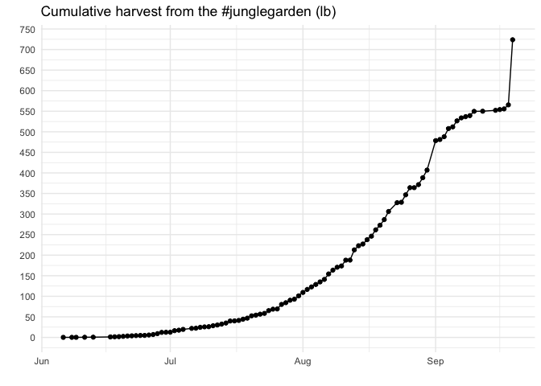

```r
library(tidyverse)
library(googlesheets4)
theme_set(theme_minimal())
gs4_deauth()
```

Read in garden plot data:

```r
garden_plot <- read_sheet("https://docs.google.com/spreadsheets/d/1jg6TTJWZhzaUo2WvW30g3bHbNPA4RD5nNs8l0HNSiaM/edit?usp=sharing")
```

Create garden plot map:

```r
garden_plot %>% 
  ggplot(aes(x = x, y = y, group = plot)) +
  geom_polygon()
```

<!-- -->

Compare to Google maps photo:


```r
knitr::include_graphics("garden_birdseye.png")
```


Read in harvest data:

```r
garden_harvest <- read_sheet("https://docs.google.com/spreadsheets/d/1DekSazCzKqPS2jnGhKue7tLxRU3GVL1oxi-4bEM5IWw/edit?usp=sharing")
```

Cumulative harvest plot:

```r
garden_harvest %>% 
  group_by(vegetable, date) %>% 
  summarize(weight = sum(weight)) %>% 
  group_by(vegetable) %>% 
  mutate(cum_harvest = cumsum(weight)) %>%
  ggplot(aes(x = date, y = cum_harvest, color = vegetable)) +
  geom_point() +
  geom_line() +
  labs(title = "Cumulative harvest from the #junglegarden (grams)",
       y = "", x = "") +
  scale_color_viridis_d() +
  scale_y_continuous(breaks = seq(0,1000,50))
```

<!-- -->

Faceted cumulative harvest:

```r
garden_harvest %>% 
  group_by(vegetable, date) %>% 
  summarize(weight = sum(weight)) %>% 
  group_by(vegetable) %>% 
  mutate(cum_harvest = cumsum(weight)) %>%
  ggplot(aes(x = date, y = cum_harvest, color = vegetable, 
             group = vegetable)) +
  geom_point() +
  geom_line() +
  labs(title = "Cumulative harvest from the #junglegarden (grams)",
       y = "", x = "") +
  scale_color_viridis_d() +
  scale_y_continuous(breaks = seq(0,500,50)) +
  facet_wrap(vars(vegetable)) +
  guides(color = "none")
```

<!-- -->

Daily harvest faceted plot:

```r
garden_harvest %>% 
  group_by(vegetable, date) %>% 
  summarize(weight = sum(weight)) %>% 
  ggplot(aes(x = date, y = weight, color = vegetable)) +
  geom_point() +
  geom_line() +
  labs(title = "Daily harvests from the #junglegarden (grams)",
       y = "", x = "") +
  scale_color_viridis_d() +
  scale_y_continuous(breaks = seq(0,500,20)) +
  facet_wrap(vars(vegetable)) +
  guides(color = "none")
```

<!-- -->


