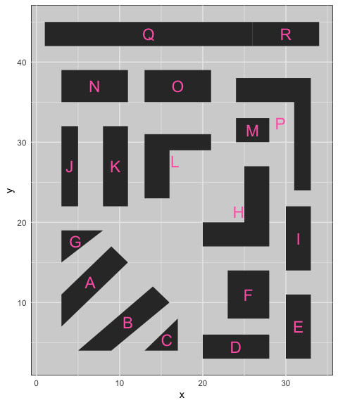
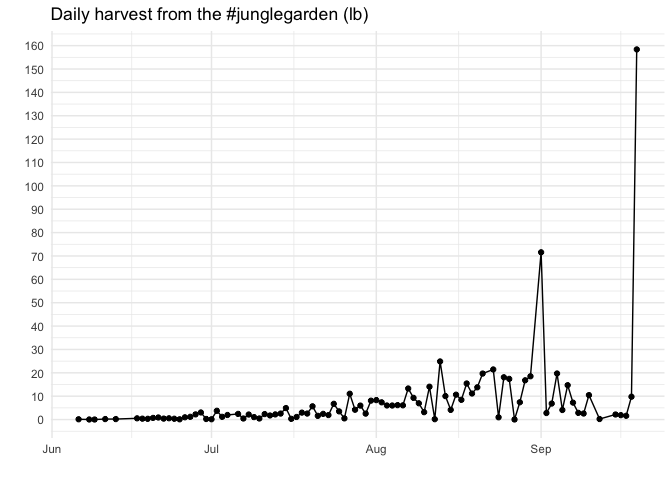
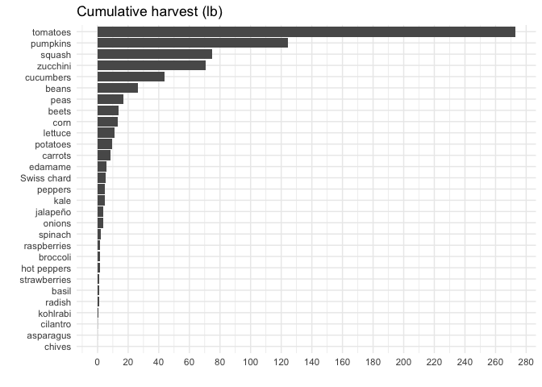
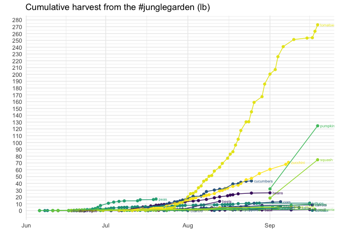
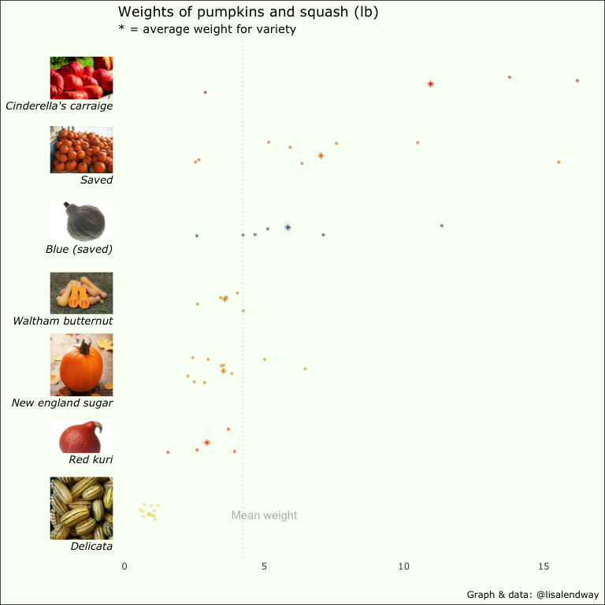
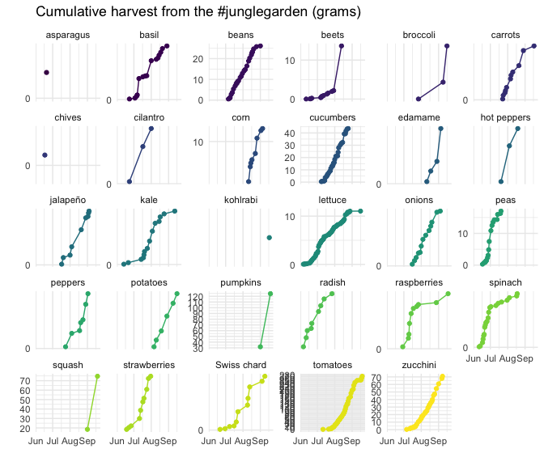

```r
library(tidyverse)
library(googlesheets4)
library(patchwork)
library(lubridate)
theme_set(theme_minimal())
gs4_deauth() #To not have to authorize each time you knit.
```

Read in garden plot data:

```r
garden_plot <- read_sheet("https://docs.google.com/spreadsheets/d/1jg6TTJWZhzaUo2WvW30g3bHbNPA4RD5nNs8l0HNSiaM/edit?usp=sharing")
```

Create garden plot map:

```r
garden_plot %>% 
  ggplot(aes(x = x, y = y, group = plot)) +
  geom_polygon()
```

<!-- -->

Compare to Google maps photo:


```r
knitr::include_graphics("garden_birdseye.png")
```


Read in harvest data:

```r
garden_harvest <- read_sheet("https://docs.google.com/spreadsheets/d/1DekSazCzKqPS2jnGhKue7tLxRU3GVL1oxi-4bEM5IWw/edit?usp=sharing") %>% 
  mutate(date = ymd(date))
```

Overall cumulative harvest and daily harvest plots:

```r
cum_harvest <- garden_harvest %>% 
  group_by(date) %>% 
  summarize(weight = sum(weight)) %>% 
  mutate(cum_harvest = cumsum(weight),
         wt_lbs = cum_harvest*0.00220462) %>%
  ggplot(aes(x = date, y = wt_lbs)) +
  geom_point() +
  geom_line() +
  labs(title = "Cumulative harvest from the #junglegarden (lbs)",
       y = "", x = "") +
  scale_y_continuous(breaks = seq(0,100,4))

daily_harvest <- garden_harvest %>% 
  group_by(date) %>% 
  summarize(weight = sum(weight),
            wt_lbs = weight*0.00220462) %>% 
  ggplot(aes(x = date, y = wt_lbs)) +
  geom_point() +
  geom_line() +
  labs(title = "Daily harvest from the #junglegarden (lbs)",
       y = "", x = "") +
  scale_y_continuous(breaks = seq(0,100,1))

cum_harvest 
```

<!-- -->

```r
daily_harvest
```

<!-- -->

Total by vegetable:


```r
garden_harvest %>% 
  mutate(wt_lbs = weight*0.00220462) %>%
  group_by(vegetable) %>% 
  summarize(wt_lbs = sum(wt_lbs)) %>% 
  arrange(desc(wt_lbs)) %>% 
  ggplot(aes(x = fct_reorder(vegetable, wt_lbs, sum),
             y = wt_lbs)) +
  geom_col() +
  coord_flip() +
  labs(title = "Cumulative harvest (lbs)", x = "", y = "")
```

<!-- -->


Cumulative harvest plot, by vegetable:

```r
smry_veg_date <- garden_harvest %>% 
  group_by(vegetable, date) %>% 
  summarize(weight = sum(weight)) %>% 
  group_by(vegetable) %>% 
  mutate(cum_harvest = cumsum(weight),
         wt_lbs = cum_harvest*0.00220462)

cum_label <- smry_veg_date %>% 
  group_by(vegetable) %>% 
  summarize(max_date = max(date) + days(1),
            max_harvest = max(wt_lbs)) 

smry_veg_date %>%
  ggplot(aes(x = date, y = wt_lbs, color = vegetable)) +
  geom_point() +
  geom_line() +
  geom_text(aes(x = max_date, 
                y = max_harvest, 
                label = vegetable),
            data = cum_label,
            size = 2,
            hjust = 0) +
  labs(title = "Cumulative harvest from the #junglegarden (lb)",
       y = "", x = "") +
  scale_color_viridis_d() +
  scale_y_continuous(breaks = seq(0,30,1)) +    
  guides(color = "none")
```

<!-- -->

```r
#  theme(legend.position = "bottom", legend.title = element_text( size=2), legend.text=element_text(size=2)) 
```

Faceted cumulative harvest:

```r
garden_harvest %>% 
  group_by(vegetable, date) %>% 
  summarize(weight = sum(weight)) %>% 
  group_by(vegetable) %>% 
  mutate(cum_harvest = cumsum(weight),
         wt_lbs = cum_harvest*0.00220462) %>%
  ggplot(aes(x = date, y = wt_lbs, color = vegetable, 
             group = vegetable)) +
  geom_point() +
  geom_line() +
  labs(title = "Cumulative harvest from the #junglegarden (grams)",
       y = "", x = "") +
  scale_color_viridis_d() +
  scale_y_continuous(breaks = seq(0,30,1)) +
  facet_wrap(vars(vegetable)) +
  guides(color = "none")
```

<!-- -->

Daily harvest faceted plot:

```r
garden_harvest %>% 
  group_by(vegetable, date) %>% 
  summarize(weight = sum(weight)) %>% 
  ggplot(aes(x = date, y = weight, color = vegetable)) +
  geom_point() +
  geom_line() +
  labs(title = "Daily harvests from the #junglegarden (grams)",
       y = "", x = "") +
  scale_color_viridis_d() +
  scale_y_continuous(breaks = seq(0,2000,100)) +
  facet_wrap(vars(vegetable)) +
  guides(color = "none")
```

<!-- -->


